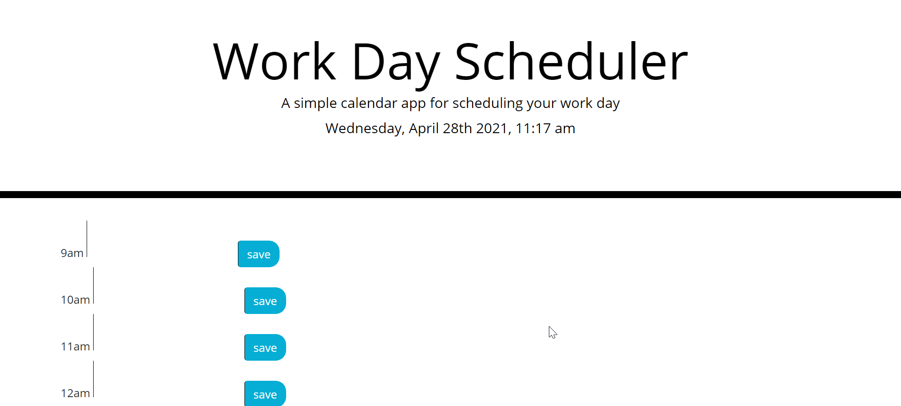

#day planner

Summary

This is a workday planner. It displays rows of text area fields for each hour of the working day. It allows information about what will be done during each our to be saved. This information can be retrieved at a later date.

Technologies used

HTML/Javascript/CSS/moment.jq/Jquery

repo link 

- Github Repo: https://github.com/Normksb/day-planner

- Link to the deployed webpage: https://normksb.github.io/day-planner

